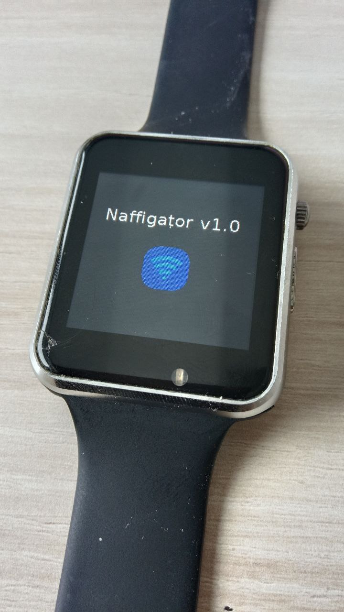
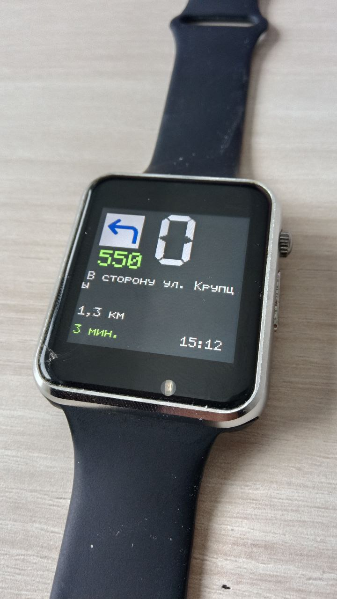

glcdfont.c  поместить в папку lib\Adafruit-GFX-Library-master

Зависимости:
- Adafruit_BusIO
- Adafruit-GFX
- Adafruit-ST7735
- AXP202X  https://github.com/lewisxhe/ESP_IDF_AXP20x_Library
- FT6236   https://github.com/DustinWatts/FT6236

Работает с любым esp32 или esp32s3. Экран любой. 
Я использовал на часах TWatch2020
